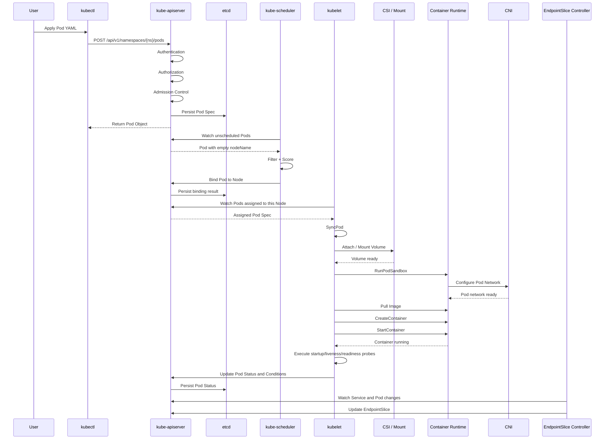

最近在工作中遇到了一次 Kubernetes Toolchain 挂载问题，涉及 Linux 文件系统、Kubernetes 集群、Volume 挂载、Mount Options、节点环境差异等多个层面。

最开始，这只是一个具体的故障排查问题：

> 为什么同一套 Toolchain，在不同节点或不同 Pod 中表现不一致？<br>
> 为什么 Volume 已经声明成功，容器内仍然会出现权限、性能或挂载行为异常？<br>
> 问题究竟发生在 Kubernetes、Linux Mount、CSI，还是应用运行环境？

但随着问题逐步展开，我发现仅仅理解 PVC、VolumeMount 或 Mount Options 并不足以解释整个故障链路。

要真正理解这类问题，需要重新回答一个更基础的问题：

> **一个 Pod 从提交 YAML 开始，到最终变为 Ready，底层到底经历了什么？**

借这次机会，我重新梳理了 Kubernetes Pod 从创建、调度、运行，到最终接收 Service 流量的完整过程，也进一步建立了对 Kubernetes Control Loop、状态收敛与故障路径的理解。

## 一、我最近常用的复盘方式

最近我经常使用下面这套方式学习技术问题，也分享给大家作为参考。

### 1. 先口述自己的理解（ChatGPT 口述）

先不急着查资料，而是直接向 ChatGPT 口述：

- 我对某个技术问题的理解；
- 我认为的执行流程；
- 我阅读源码后得到的结论；
- 我对故障原因的初步判断。

这个过程的价值不在于立即得到答案，而在于：

> **把脑中的隐性认知显性化。**

很多时候，我们以为自己“理解了”，实际上只是记住了几个组件名称，并没有真正建立因果关系。所以人们常说当你能够给一个 beginner 讲明白，你才真正理解了。

### 2. 根据反馈逐步验证

根据 ChatGPT 提供的疑点、反例和源码入口，再自己验证：

- 每一步由哪个组件负责；
- 状态写在哪里；
- 谁在 Watch；
- 谁在 Reconcile；
- 哪个状态是原因，哪个状态只是结果；
- 故障发生时应该看 Events、Logs、Metrics，还是节点环境。

### 3. 最后形成完整模型

最终输出的不只是零散笔记，而是：

- 一张完整流程图；
- 一条可解释的状态链路；
- 一组源码入口；
- 一套故障排查路径；
- 一份可复用的 Runbook 或 SOP。

ChatGPT 对我当时状态的评价是：

> **你现在的问题已经不是“会不会使用 Kubernetes”，而是正在从“使用 Kubernetes”向“理解 Kubernetes”过渡。**
>
> 当前最大的瓶颈并不是知识量，而是还没有完全建立 Kubernetes 控制面的因果关系，也就是 Control Loop。

我认为这个判断非常准确。

## 二、最初没有回答清楚的几个问题

在复盘 Pod 创建流程时，我发现自己没有真正口述清楚下面几个问题：

1. 谁负责调度 Pod？
2. API Server 如何让其他组件感知状态变化？
3. Pod 的 `Ready=True` 到底从哪里来？
4. kubelet 的核心职责是什么？
5. Controller 的本质是什么？
6. Service 为什么只把流量转发给 Ready Pod？
7. Volume 挂载发生在什么阶段？
8. `ContainerCreating` 为什么可能持续很久？

这些问题看似分散，实际上都指向 Kubernetes 最核心的设计：

> **Control Loop，控制循环。**

## 三、真正的 Kubernetes 思维：不是流程，而是状态收敛

过去阅读 Kubernetes 官方文档或学习单个组件时，我经常下意识地把系统理解成下面这种串行流程：

```text
组件 A
  ↓
组件 B
  ↓
组件 C
```

这是一种典型的“流程图思维”。

它适合解释一次性的调用链，但并不能准确描述 Kubernetes。

Kubernetes 更接近下面这种模型：

```text
                    Desired State
                         │
                         ▼
                   kube-apiserver
                         │
                         ▼
                        etcd
                         │
              ───────── Watch ─────────
             │             │            │
             ▼             ▼            ▼
        Scheduler      Controller     kubelet
             │             │            │
             └──────── Reconcile ───────┘
                         │
                         ▼
                    Actual State
```

这里最重要的不是“谁调用了谁”，而是：

1. 用户声明期望状态；
2. API Server 保存状态；
3. 各组件通过 Watch 感知对象变化；
4. 各自执行 Reconcile；
5. 不断推动实际状态接近期望状态；
6. 再把新的实际状态写回 API Server。

严格来说，并不是“完全没人通知别人”。

更准确的描述是：

> Kubernetes 组件之间通常不通过强耦合的点对点调用推动流程，而是由 API Server 提供统一状态入口，并通过 List/Watch 机制向各组件持续传递对象变化。

各组件共同遵循以下模式：

```text
Watch API Server
        ↓
发现状态变化
        ↓
比较 Desired State 与 Actual State
        ↓
执行 Reconcile
        ↓
更新状态
        ↓
继续 Watch
```

这就是 Kubernetes 最重要的设计思想之一。

AI 辅助学习对我最大的帮助，也不是简单解释某个 API，而是帮助我把分散的组件知识重新组织成一套状态驱动的系统模型。

## 四、Pod 从创建到 Ready 的完整过程

下面重新梳理一个 Pod 从提交 YAML，到最终接收 Service 流量的全过程。

### 4.1 全流程总览

| 阶段 | 主要负责组件 | 核心动作 |
|---|---|---|
| ① 提交请求 | kubectl / Client | 将 Pod YAML 转换为 API 请求 |
| ② 身份认证 | kube-apiserver | Authentication |
| ③ 权限校验 | kube-apiserver | Authorization / RBAC |
| ④ 准入控制 | kube-apiserver | Defaulting、LimitRange、ResourceQuota、Admission Webhook |
| ⑤ 持久化对象 | kube-apiserver / etcd | 将 Pod Spec 写入 etcd |
| ⑥ 发现未调度 Pod | kube-scheduler | Watch `spec.nodeName` 为空的 Pod |
| ⑦ 调度决策 | kube-scheduler | Filter、Score、Reserve、Permit、Bind |
| ⑧ 写入绑定结果 | kube-scheduler / API Server | 将 Pod 绑定到目标 Node |
| ⑨ 节点侧接管 | kubelet | Watch 分配给本节点的 Pod |
| ⑩ 同步 Pod | kubelet | 执行 SyncPod，协调 Sandbox、Volume、Container |
| ⑪ 准备存储 | kubelet / CSI / Linux Mount | Attach、Mount、权限与挂载参数处理 |
| ⑫ 准备网络 | kubelet / CRI / CNI | 创建 Pod Sandbox 和网络命名空间 |
| ⑬ 拉取镜像 | kubelet / Container Runtime | Pull Image |
| ⑭ 创建容器 | Container Runtime | CreateContainer |
| ⑮ 启动容器 | Container Runtime | StartContainer |
| ⑯ 健康检查 | kubelet | Startup、Liveness、Readiness Probe |
| ⑰ 更新 Pod Status | kubelet | 写入 ContainerStatus 和 Pod Conditions |
| ⑱ Pod Ready | kubelet / API Server | 满足条件后更新 `Ready=True` |
| ⑲ 更新 EndpointSlice | EndpointSlice Controller | 将 Ready Pod 加入 Service 后端 |
| ⑳ 转发流量 | kube-proxy / CNI 数据面 | Service 开始把流量转发到 Pod |

### 4.2 API Server：系统状态入口

当执行：

```bash
kubectl apply -f pod.yaml
```

kubectl 会向 kube-apiserver 发送请求。

API Server 会依次执行：

```text
Authentication
      ↓
Authorization
      ↓
Admission Control
      ↓
Schema Validation
      ↓
写入 etcd
```

这里需要注意：

> API Server 并不会亲自创建容器，也不会亲自调度 Pod。

它的主要职责是：

- 提供统一 API；
- 验证请求；
- 执行准入策略；
- 保存集群状态；
- 提供 List/Watch；
- 作为各控制器之间的状态协调中心。

Pod 对象刚写入 etcd 时，通常还没有绑定节点：

```yaml
spec:
  nodeName: ""
```

此时它只是一个“待实现的期望状态”。

### 4.3 Scheduler：负责选择节点，不负责启动容器

kube-scheduler 会 Watch 尚未绑定节点的 Pod。

其核心调度过程可以抽象为：

```text
Pending Pod
    ↓
PreFilter
    ↓
Filter
    ↓
Score
    ↓
Reserve
    ↓
Permit
    ↓
Bind
```

其中最常见的是：

#### Filter

过滤掉不满足条件的节点，例如：

- CPU 或 Memory 不足；
- NodeSelector 不匹配；
- NodeAffinity 不满足；
- 存在无法容忍的 Taint；
- PVC / Volume 拓扑不匹配；
- PodAffinity / PodAntiAffinity 不满足；
- HostPort 冲突。

#### Score

对剩余节点打分，例如：

- 资源是否均衡；
- 节点亲和性得分；
- Pod 分布是否合理；
- 镜像是否已经存在；
- 拓扑分布是否满足预期。

最终 Scheduler 会选择一个节点，并通过 Binding 将结果写回 API Server。

关键点是：

> Scheduler 只负责决定“Pod 应该运行在哪个 Node”，并不负责真正创建容器。

### 4.4 kubelet：把 Pod Spec 变成节点上的真实进程

Pod 被绑定到某个 Node 后，该 Node 上的 kubelet 会通过 Watch 感知这个 Pod。

kubelet 的核心任务是：

> 持续比较 Pod Spec 与节点实际运行状态，并通过 SyncPod 推动两者收敛。

可以简单理解为：

```text
Watch assigned Pod
        ↓
Pod Worker
        ↓
SyncPod()
        ↓
检查 Volume
        ↓
创建 Pod Sandbox
        ↓
配置 Network
        ↓
拉取 Image
        ↓
创建 Container
        ↓
启动 Container
        ↓
执行 Probe
        ↓
更新 Pod Status
```

kubelet 并不是只执行一次启动动作。

它会持续同步：

- 容器是否应该存在；
- 容器是否异常退出；
- Volume 是否挂载成功；
- Probe 是否通过；
- Pod 是否被删除；
- Pod 是否需要重建；
- 实际状态是否与 Spec 一致。

这也是为什么：

> **SyncPod 是理解 kubelet 的核心入口。**

### 4.5 CRI、CNI、CSI：Pod 真正运行的底层接口

Pod 从“已调度”变成“可运行”，通常离不开三类关键接口。

#### 4.5.1 CRI：Container Runtime Interface

CRI 负责 kubelet 与容器运行时之间的交互。

典型调用包括：

```text
RunPodSandbox()
CreateContainer()
StartContainer()
StopContainer()
RemoveContainer()
```

常见运行时包括：

- containerd；
- CRI-O。

#### 4.5.2 CNI：Container Network Interface

CNI 负责为 Pod 准备网络，例如：

- 创建网络接口；
- 分配 Pod IP；
- 配置路由；
- 配置网络命名空间；
- 建立 veth；
- 应用 NetworkPolicy 相关能力。

因此，当 Pod 长时间处于 `ContainerCreating` 时，问题不一定是镜像拉取，也可能是 CNI 网络配置失败（例如，网络插件未加载、网络命名空间未创建等）。

#### 4.5.3 CSI：Container Storage Interface

CSI 负责 Kubernetes 与存储系统之间的交互，例如：

- Attach Volume；
- Stage Volume；
- Publish Volume；
- Mount Volume；
- Unmount Volume。

对于 Toolchain、共享目录、NAS 或高性能文件系统，问题还可能继续向下延伸到 Linux 层：

```text
PVC / PV
   ↓
CSI Driver
   ↓
NodePublishVolume
   ↓
mount syscall
   ↓
Filesystem
   ↓
Mount Options
   ↓
容器内实际访问行为
```

这也是这次 Toolchain 挂载问题给我的启发：

> Kubernetes Volume 配置正确，并不代表最终文件系统行为一定正确。

还需要继续验证：

- mount options；
- read-only / read-write；
- NFS 参数；
- UID / GID；
- root squash；
- SELinux；
- propagation；
- inode；
- page cache；
- I/O 延迟；
- 节点内核版本；
- 容器运行时差异。

延伸本次 Toolchain 挂载缓存问题：Pod 重建本身不会 自动刷新 Linux 内核级的 NFS 属性缓存。但是，Pod 重建触发的 CSI Unstage/Stage 流程会强制刷新缓存（前提是 CSI 驱动正确实现了卸载再挂载）。

为了方便理解，这里大致写了 POD Create/Delete CSI 相关调用流程：
```
Pod Delete → Kubelet 调用:
  1. CSI NodeUnpublishVolume  ← 解除 bind mount（容器视角）
  2. CSI NodeUnstageVolume    ← 执行 umount（节点视角）

Pod Create → Kubelet 调用:
  3. CSI NodeStageVolume      ← 执行 mount -t nfs ...
  4. CSI NodePublishVolume    ← 创建 bind mount
```

说明：
1. 如果 Step 2 成功执行了 umount → 内核释放 superblock → Step 3 的 mount 建立全新会话 → 缓存彻底刷新 ✅
2. 如果 Step 2 因 "device busy" 失败 → 旧 mount 仍存活 → Step 3 可能复用旧 superblock 或直接报错 → 缓存未刷新 ❌

### 4.6 Pod Ready 到底是怎么来的

Pod 启动成功，不等于 Pod Ready。

kubelet 会持续维护 Pod Conditions，例如：

```text
PodScheduled
Initialized
ContainersReady
Ready
```

一个 Pod 常见的状态变化是：

```text
PodScheduled=True
        ↓
Initialized=True
        ↓
ContainersReady=True
        ↓
Ready=True
```

其中 `Ready=True` 并不是简单等于“进程存在”。

它通常取决于：

- 所有必要容器已经启动；
- Readiness Probe 通过；
- Init Container 已完成；
- 自定义 Readiness Gates 满足；
- Pod 没有处于终止阶段。

因此：

> `Running` 只表示 Pod 已进入运行阶段，`Ready` 才表示它具备对外提供服务的条件。

这也是排障时经常需要区分的两个概念。

### 4.7 Service 为什么知道 Pod Ready

Pod Ready 状态写回 API Server 后，EndpointSlice Controller 会根据：

- Service Selector；
- Pod Label；
- Pod IP；
- Pod Ready Condition；

更新对应的 EndpointSlice。

可以抽象为：

```text
Pod Ready=True
      ↓
EndpointSlice Controller Reconcile
      ↓
更新 EndpointSlice
      ↓
Service 后端出现该 Pod IP
      ↓
kube-proxy / eBPF 数据面更新
      ↓
流量开始进入 Pod
```

因此，当出现：

```text
Pod 正常运行
但 Service 没有流量
```

不能只检查容器日志，还需要继续检查：

```text
Readiness Probe
      ↓
Pod Conditions
      ↓
Service Selector
      ↓
EndpointSlice
      ↓
kube-proxy / CNI 数据面
```

## 五、Pod 创建全过程时序图



推荐结合源码分析工具继续阅读：

- DeepWiki Code Map：<br>
  <https://deepwiki.com/search/k8s-pod_7b5ad608-0148-4469-81fc-318d15e53365?mode=codemap>


## 六、这次复盘暴露出的主要盲点

按照重要程度排序：

| 优先级 | 盲点 | 为什么重要 |
|---|---|---|
| ⭐⭐⭐⭐⭐ | List/Watch 机制 | Kubernetes 组件感知状态变化的基础 |
| ⭐⭐⭐⭐⭐ | Reconcile | Controller 的本质，也是 Kubernetes 的核心运行模型 |
| ⭐⭐⭐⭐⭐ | kubelet SyncPod | Pod 从声明状态走向真实运行状态的关键 |
| ⭐⭐⭐⭐ | Scheduler Filter / Score | 理解 Pod Pending、调度失败和资源策略的基础 |
| ⭐⭐⭐⭐ | CRI / CNI / CSI | Pod 真正启动、联网和挂载存储的底层路径 |
| ⭐⭐⭐⭐ | Linux Mount / Filesystem | Kubernetes 存储问题最终经常落在操作系统层 |
| ⭐⭐⭐ | Probe 与 Pod Conditions | 理解 `Running`、`ContainersReady`、`Ready` 的区别 |
| ⭐⭐⭐ | EndpointSlice | 理解 Service 为什么有流量或没有流量 |
| ⭐⭐⭐ | Events 的生成链路 | 快速判断问题发生在哪个控制器或节点阶段 |
| ⭐⭐ | Status 与 Spec 的边界 | 区分期望状态、实际状态和控制器职责 |

## 七、从 DevOps / SRE 角度学习 Kubernetes

很多人学习 Kubernetes，包括我自己，最初关注的往往是分散的对象：

```text
Pod
Deployment
Service
Ingress
ConfigMap
Secret
```

这是学习 Kubernetes API 对象的常见路线。

但从 DevOps、SRE 或平台工程师角度，更重要的问题是：

```text
为什么 Pod Pending？
为什么 Pod 一直 ContainerCreating？
为什么出现 ImagePullBackOff？
为什么 Ready=False？
为什么 CrashLoopBackOff？
为什么 Service 没有流量？
为什么 Node 变成 NotReady？
为什么 Scheduler 不调度？
为什么 Volume Mount 失败？
为什么同一镜像在不同节点行为不同？
```

因此，学习重点不应该只停留在：

> Kubernetes 有哪些对象。

而应该升级为：

> **Kubernetes 的状态为什么没有收敛，阻塞发生在哪一层。**

这次 Toolchain 挂载问题也说明了这一点。

表面问题可能是：

```text
Toolchain 无法正常访问
```

但实际故障链路可能是：

```text
Pod Spec
  ↓
PVC / PV
  ↓
CSI
  ↓
Node Mount
  ↓
Linux Filesystem
  ↓
Mount Options
  ↓
UID / GID / Permission
  ↓
应用访问行为
```

对线上 precheck、dailybuild、central build 等平台任务而言，这类排障经验非常有价值。

因为它最终可以沉淀为：

- 故障树；
- Runbook；
- SOP；
- 自动诊断脚本；
- 监控指标；
- 告警规则；

这比单纯解决一次故障更有长期价值。

## 八、建议建立 Kubernetes 故障路径模型

### 8.1 Pod Pending

```text
Pod Pending
    ↓
查看 Pod Events
    ↓
Scheduler 是否产生 FailedScheduling
    ↓
Node Resources
    ↓
NodeSelector / Affinity
    ↓
Taint / Toleration
    ↓
PVC / Volume Topology
    ↓
Quota / LimitRange
    ↓
找到调度阻塞条件
```

常用命令：

```bash
kubectl describe pod <pod-name> -n <namespace>
kubectl get events -n <namespace> --sort-by=.lastTimestamp
kubectl get nodes -o wide
kubectl describe node <node-name>
```

### 8.2 ContainerCreating

```text
ContainerCreating
        ↓
查看 Events
        ↓
Image Pull
        ↓
CNI
        ↓
CSI / Volume Mount
        ↓
Secret / ConfigMap
        ↓
Sandbox 创建
        ↓
Node Runtime / Kernel
```

重点检查：

```bash
kubectl describe pod <pod-name> -n <namespace>
journalctl -u kubelet
crictl pods
crictl ps -a
mount
findmnt
dmesg
```

### 8.3 Ready=False

```text
Ready=False
     ↓
查看 Pod Conditions
     ↓
Readiness Probe
     ↓
Container Logs
     ↓
Application Port
     ↓
Dependency Service
     ↓
EndpointSlice
     ↓
Service Data Plane
```

常用命令：

```bash
kubectl get pod <pod-name> -n <namespace> -o yaml
kubectl logs <pod-name> -n <namespace> --all-containers
kubectl get endpointslice -n <namespace>
kubectl describe service <service-name> -n <namespace>
```

### 8.4 Volume Mount 异常

```text
Volume Mount Error
        ↓
Pod Events
        ↓
PVC / PV Status
        ↓
StorageClass
        ↓
CSI Controller
        ↓
CSI Node Plugin
        ↓
Node Mount Point
        ↓
Linux Mount Options
        ↓
Filesystem / Permission / Performance
```

对于 Toolchain 这类共享目录，还需要关注：

```text
Correctness
  ├─ 是否挂载成功
  ├─ 路径是否一致
  ├─ 权限是否正确
  └─ 文件是否完整

Performance
  ├─ metadata latency
  ├─ random read
  ├─ page cache
  ├─ mount options
  └─ concurrent access

Consistency
  ├─ cache consistency
  ├─ file lock
  ├─ stale handle
  └─ node differences

Operability
  ├─ 日志
  ├─ 指标
  ├─ 告警
  └─ 故障恢复
```

## 九、后续 Learning Path

### 第一层：知道发生了什么

目前这一层已经基本完成。

```text
kubectl
   ↓
API Server
   ↓
Scheduler
   ↓
kubelet
   ↓
containerd
   ↓
Ready
   ↓
EndpointSlice
   ↓
Service Traffic
```

目标是能够完整解释：

- 每一步由谁负责；
- 状态写在哪里；
- 下一个组件为什么会开始工作；
- 某一步失败时会表现为什么状态。

### 第二层：知道源码在哪里

#### Scheduler

```text
ScheduleOne()
    ↓
SchedulePod()
    ↓
PreFilter
    ↓
Filter
    ↓
Score
    ↓
Reserve
    ↓
Permit
    ↓
Bind()
```

重点理解：

- 调度队列；
- Scheduling Framework；
- Filter Plugin；
- Score Plugin；
- Binding Cycle；
- 调度失败后的重试。

#### kubelet

```text
syncLoop()
    ↓
HandlePodAdditions()
    ↓
Pod Worker
    ↓
SyncPod()
    ↓
Container Runtime / Volume / Probe
```

重点理解：

- Pod Manager；
- PLEG；
- Pod Worker；
- Runtime Manager；
- Volume Manager；
- Status Manager；
- Probe Manager。

#### Container Runtime

```text
RunPodSandbox()
    ↓
CNI Setup
    ↓
CreateContainer()
    ↓
StartContainer()
```

重点理解：

- Sandbox；
- Pause Container；
- CRI；
- Container Lifecycle；
- Runtime Status。

#### CSI

```text
ControllerPublishVolume
        ↓
NodeStageVolume
        ↓
NodePublishVolume
        ↓
mount()
```

重点理解：

- Controller Plugin 与 Node Plugin；
- Attach 与 Mount；
- Volume lifecycle；
- Mount Options；
- Node 侧故障定位。

### 第三层：知道线上怎么排查

这一层的目标不是记住命令，而是形成固定的排障顺序：

```text
现象
 ↓
状态
 ↓
事件
 ↓
负责组件
 ↓
控制循环
 ↓
底层依赖
 ↓
根因
```

例如：

```text
Pod Pending
    ↓
FailedScheduling Event
    ↓
Scheduler
    ↓
Filter Plugin
    ↓
Resource / Affinity / Taint / PVC
    ↓
根因定位
```

或者：

```text
Ready=False
    ↓
Pod Condition
    ↓
Readiness Probe
    ↓
Application Dependency
    ↓
EndpointSlice
    ↓
Service Traffic
```

这才是真正的平台工程师思维。

### 第四层：把排障经验产品化 (Skills)

对于 DevOps 平台而言，学习的终点不应该只是“我会排查”。

更高一层是：

> 如何让下一个人不需要重复排查。

可以逐步沉淀为：

```text
个人经验
   ↓
排障文档
   ↓
Runbook
   ↓
自动化脚本
   ↓
可观测 Dashboard
   ↓
自动诊断
   ↓
自动修复
   ↓
平台能力
```

以 Toolchain 挂载问题为例，可以进一步形成：

- 节点挂载一致性检查；
- Mount Options 基线检查；
- CSI 健康检查；
- Toolchain 文件完整性检查；
- I/O 延迟基线；
- Pod 启动阶段耗时分析；
- 节点差异自动对比；
- 故障时自动采集 kubelet、mount、CSI 日志。

这会把一次故障排查，转化为长期的平台资产。

## 十、建立新的学习模型

根据这几个月围绕 Jenkins、Kubernetes、Central Build、Merge Train、Agent 和平台工程的持续学习，我后续不应该只停留在“源码阅读”。

更适合我的学习模型应该是：

```text
                       DevOps / Platform Engineer / SRE
                                      │
          ┌───────────────────────────┼───────────────────────────┐
          │                           │                           │
     Architecture                Control Loop              Troubleshooting
   为什么这样设计              状态如何变化与收敛             线上如何定位故障
          │                           │                           │
          ├───────────────┬───────────┴───────────┬───────────────┤
          │               │                       │               │
     API Server       Scheduler                kubelet        containerd
          │               │                       │               │
          └───────────────┴───────────────┬───────┴───────────────┘
                                          │
                                Source Code + Observability
                                          │
                                  Runbook + Automation
                                          │
                                  Platform Capability
```

这套模型可以概括为五个问题：

1. **Architecture**：为什么这样设计？
2. **State**：期望状态和实际状态分别是什么？
3. **Control Loop**：哪个组件负责推动状态收敛？
4. **Troubleshooting**：状态为什么没有收敛？
5. **Platformization**：如何把解决方案沉淀为平台能力？

## 十一、从 Kubernetes 迁移到平台工程

这也是为什么最近研究 Agent、Control Plane、Central Build、Merge Train、Kubernetes DRA 时，会逐渐发现它们具有相似的设计模式。

它们本质上都可以抽象为：

```text
声明期望状态
    ↓
记录系统状态
    ↓
控制器持续观察
    ↓
执行调度与编排
    ↓
状态不断收敛
    ↓
异常重试与恢复
    ↓
可观测与审计
```

也就是：

> **Desired State → Control Loop → Reconcile → Observability → Recovery**

例如 Central Build / Merge Train 也可以这样理解：

```text
Desired State
  PR 希望进入可合并状态
        ↓
Control Plane
  TrainSet / Queue / CI Job
        ↓
Reconcile
  Rebase / Build / Validate / Finalize
        ↓
Observed State
  queued / building / success / failed / stale
        ↓
Recovery
  retry / realign / discard / cleanup
```

DevOps Agent Control Plane 也同样如此：

```text
Desired Task
    ↓
Planner / Orchestrator
    ↓
Tool Execution
    ↓
State Tracking
    ↓
Evaluation
    ↓
Retry / Human Approval / Recovery
```

更多细节可以参考：
- [Kubernetes 架构](https://kubernetes.io/docs/concepts/overview)
- [DevOps Agent Control Plane](https://github.com/zhililab/DevOps-Agent-Control-Plane)

当真正建立这套思维框架后，理解 Kubernetes 只是其中一个结果。

更重要的是，它会逐渐形成一种可迁移的系统设计能力：

- 如何设计状态机；
- 如何实现幂等；
- 如何处理重试；
- 如何避免强耦合；
- 如何建立可观测性；
- 如何设计故障恢复；
- 如何把人工流程转化为控制循环。

这才是从 DevOps 工程师走向平台工程师和复杂系统架构设计者的关键一步。

## 十二、后续 Action Items

### 1. Kubernetes 架构

目标：

- 理解 API Server、Scheduler、Controller Manager、kubelet、containerd 的职责边界；
- 理解控制面与数据面的关系；
- 理解组件之间为什么通过 API Server 协作。

产出：

- Kubernetes 架构图；
- 组件职责表；
- 关键对象状态流转图。

### 2. Kubernetes Control Loop

目标：

- 理解 List/Watch；
- 理解 Controller；
- 理解 Reconcile；
- 理解 Spec、Status、Condition；
- 理解最终一致性。

产出：

- Deployment Controller 状态收敛分析；
- Scheduler 调度循环分析；
- kubelet SyncPod 分析。

### 3. Kubernetes 故障路径

目标：

- 建立 Pending、ContainerCreating、CrashLoopBackOff、Ready=False、NodeNotReady、Mount Failed 等故障树；
- 明确每类故障应该优先检查哪个组件。

产出：

- Kubernetes Troubleshooting Runbook；
- precheck / dailybuild 常见故障 SOP；
- 自动采集诊断脚本。

### 4. Kubernetes 可观测性

目标：

- 理解 Events、Logs、Metrics、Traces 的边界；
- 建立 Pod 启动阶段耗时观测；
- 建立 Scheduler、kubelet、CSI、CNI 关键指标。

产出：

- Pod 生命周期 Dashboard；
- Node 健康 Dashboard；
- Volume Mount 监控；
- 调度失败告警；
- precheck 运行环境健康检查。

### 5. Toolchain 挂载专项

目标：

- 梳理 Kubernetes Volume 到 Linux Mount 的完整链路；
- 对比不同节点的 Mount Options、Kernel、Runtime、Filesystem 行为；
- 建立 Toolchain 挂载基线。

产出：

- Mount Options 标准；
- 节点一致性检查脚本；
- Toolchain I/O 性能基线；
- CSI / NAS 故障 Runbook；
- 可复现的最小验证环境。

## 结语

这次 K8s Toolchain 挂载问题让我重新意识到：

> 一个优秀的故障排查，不应该只回答“这次为什么坏了”，还应该回答“系统为什么会以这种方式坏掉”。

从 Pod、Scheduler、kubelet、CSI，到 Linux Mount 和文件系统，表面上是不同技术领域，背后其实仍然是同一条主线：

```text
期望状态
   ↓
状态变化
   ↓
控制循环
   ↓
实际执行
   ↓
状态反馈
   ↓
持续收敛
```

后续我的学习也会继续沿着这条主线推进：

```text
理解架构
   ↓
理解状态
   ↓
理解控制循环
   ↓
理解故障路径
   ↓
建立可观测性
   ↓
沉淀自动化
   ↓
形成平台能力
```

最终目标不只是更熟悉 Kubernetes，而是逐渐建立一套能够迁移到 CI/CD、Merge Train、Central Build、Agent Control Plane 和未来 DevOps 平台设计中的系统级思维框架。<br> AI 大模型时代，系统设计能力将被放大，更多复杂系统将被设计和实现，这将为 DevOps 工程师/平台工程师提供更多的机会和挑战。

> Talk is cheap, show me the code it not enough. Show me your design thinking and architecture and tell me why.
